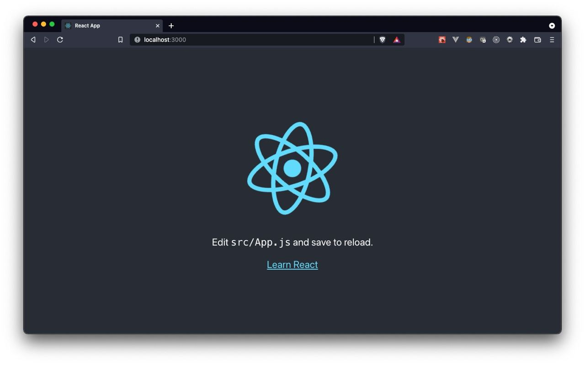

# Introduction to Web Development with React
TODO

## Outline
### 1. Web 101
- How web apps work
- The 2 _typical_ kinds of web apps
    - Server-side rendering 
        - How it works: Request-to-render lifecycle
        - Example: Cathay seat booking

    - Client-side rendering (the typical SPA)
        - How it works: Request-to-full-render lifecycle
        - Example: Youtube

### 2. Getting started with react
- Display (read) 👀
    - Plain ol' HTML in JSX
    - Rendering HTML with variables
    - Rendering a list of objects

- Actions (write) ⌨️
    - What is “State”
    - How to modify state
      - Counter button example
      - TODO list example (CRUD)

- Modularisation with React Components
    - Split out TODO code into a component

### 3. Getting data into our frontend
- Query for TODOs displaying, from https://jsonplaceholder.typicode.com/todos 📝

### 4. Demo time
- Styling our app with emotion / styled-components 💅
- Using component libraries like ant-design 🐜

---

## Installation Guide
(for those who wanna follow along)

1. Install nodejs: https://nodejs.org/en/download/
2. create-react-app: https://reactjs.org/docs/create-a-new-react-app.html#create-react-app
3. Visit localhost:3000 (if it doesn’t automatically appear)
4. Make sure you see the following page:
   
5. Open up your favourite ide (e.g. vscode or intellij, not notepad++) and import (open) the project
6. Try changing the "Edit src/App.js and save to reload." text to "Hello world!" and see the automagical reload
7. 🚀

---

### Further Exploration
- Frontend fundamentals
    - Pages in an SPA
    - CSS
    - JS and TS
- Backend fundamentals
    - Notice we're using jsonplaceholder to fetch TODOs data - try creating your own? Enter the world of backend development
- Fullstack development
    - Automated testing - Unit, E2E
    - Richer frontend frameworks - Next, Gatsby, etc.
    - Richer backend frameworks
        - Express, Flask,
        - Nest, Django, Spring
